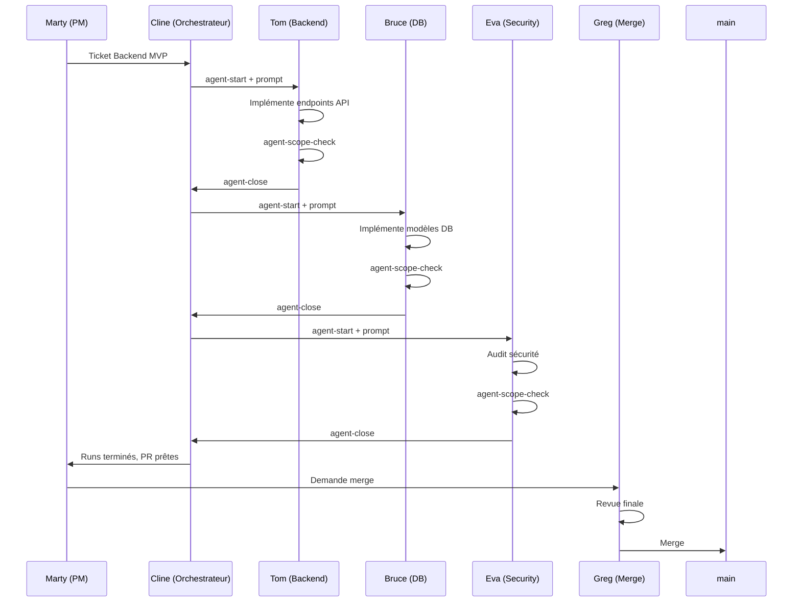

# AGENTS_RUNTIME_V1 — Activation Agents Option B

> **But** : Activer les agents PixelProwlers "corps + esprit" dans le repo avec isolation, traçabilité et audit.

---

## 1. Objectif

Ce document définit l'architecture runtime "Option B" pour les agents IA :
- **1 agent = 1 worktree = 1 branche = 1 ticket**
- Exécution isolée (sandbox) avec scope restreint
- Commits propres et audit-able
- Prompts générés depuis `agents/profiles/*.json`

### Non-négociables (Doctrine PixelProwlers)

- ❌ **Jamais de secrets en clair** dans les fichiers, logs ou commits
- ❌ **Jamais de push automatique sur main**
- ❌ **No v-html, no dangerous DOM, no remote assets**
- ✅ **Privacy-first** : minimisation des données, logs sans PII
- ✅ **Audit-able** : chaque action loggée, chaque commit traçable

---

## 2. Architecture Option B

### 2.1 Vue d'ensemble

```
Repository principal (main)
    │
    ├── .worktrees/
    │   ├── TKT_backend_mvp_api/
    │   │   └── tom/                    ← Worktree agent Tom
    │   │       ├── .agent/
    │   │       │   ├── manifest.json   ← Config du run
    │   │       │   └── REPORT.md       ← Généré à la clôture
    │   │       └── [copie du repo]
    │   │
    │   ├── TKT_backend_mvp_db/
    │   │   └── bruce/                  ← Worktree agent Bruce
    │   │       └── ...
    │   │
    │   └── TKT_backend_mvp_security/
    │       └── eva/                    ← Worktree agent Eva
    │           └── ...
    │
    ├── agents/
    │   ├── agents_registry.json        ← Source de vérité agents
    │   └── profiles/
    │       ├── tom_agent.json
    │       ├── bruce_agent.json
    │       └── eva_agent.json
    │
    └── tools/
        └── agent_runtime.py            ← CLI runtime Option B
```

### 2.2 Conventions de nommage

| Élément | Pattern | Exemple |
|---------|---------|---------|
| **Worktree path** | `.worktrees/<TICKET>/<agent>/` | `.worktrees/TKT_backend_mvp/tom/` |
| **Branch** | `feat/<TICKET>-<agent>` | `feat/TKT_backend_mvp-tom` |
| **Commit** | `<type>(<area>): <description>` | `feat(api): add contact endpoint` |

### 2.3 Types de commit autorisés

```
feat(<area>): ...   # Nouvelle fonctionnalité
fix(<area>): ...    # Correction de bug
docs(<area>): ...   # Documentation uniquement
test(<area>): ...   # Ajout/modification de tests
chore(<area>): ...  # Maintenance, tooling
refactor(<area>): ... # Refactoring sans changement fonctionnel
```

---

## 3. RACI Runtime

| Rôle | Accountable | Responsible | Consulted | Informed |
|------|-------------|-------------|-----------|----------|
| **Démarrage run** | Marty | Agent | Dan/Eva | Greg |
| **Exécution code** | Agent | Agent | Tom/Bruce/Eva | Dan |
| **Scope check** | Eva | Agent | Dan | Marty |
| **Clôture run** | Marty | Agent | Dan/Eva | Greg |
| **Merge final** | Greg | Marty | Eva | All |

**Légende** :
- **Accountable (A)** : Décision finale
- **Responsible (R)** : Exécute la tâche
- **Consulted (C)** : Donne son avis avant
- **Informed (I)** : Notifié après

---

## 4. Règles d'autorité

### 4.1 Ce que l'agent PEUT faire

| Action | Conditions |
|--------|------------|
| ✅ Modifier fichiers dans son scope | Défini dans `manifest.json` |
| ✅ Committer dans son worktree | Conventions de commit respectées |
| ✅ Créer fichiers dans son scope | Nouveaux fichiers autorisés |
| ✅ Lancer tests locaux | Dans la sandbox |
| ✅ Lire fichiers hors scope | Lecture seule OK |

### 4.2 Ce que l'agent NE PEUT PAS faire

| Action interdite | Rationale |
|------------------|-----------|
| ❌ Modifier `.github/workflows/**` | CI protégée |
| ❌ Modifier `scripts/guards/**` | Guards de sécurité |
| ❌ Modifier `tools/ssot_*.py` | Tooling SSOT protégé |
| ❌ Modifier fichiers "safety" sans ticket | Voir §4.3 |
| ❌ Push sur `main` | Toujours via PR |
| ❌ Accéder aux secrets système | `~/.ssh`, `~/.gnupg`, `.env*` |
| ❌ Réseau externe (en mode sandbox) | Isolation stricte |

### 4.3 Fichiers "safety" protégés

Ces fichiers nécessitent un ticket explicite avec revue Eva :

```
.github/workflows/**
scripts/guards/**
tools/ssot_*.py
tools/agent_runtime.py
docs/40-security/**
Makefile
.gitignore
```

---

## 5. Scope Allowlist par Agent

### 5.1 Tom (Backend API)

```json
{
  "agent": "tom",
  "scopeAllowlist": [
    "backend_django/apps/**",
    "backend_django/pixel_backend/**",
    "docs/30-tech_specs/backend/**",
    "tests/backend/**"
  ],
  "scopeDenylist": [
    "backend_django/.env*",
    "backend_django/pixel_backend/settings/prod.py"
  ]
}
```

### 5.2 Bruce (Database)

```json
{
  "agent": "bruce",
  "scopeAllowlist": [
    "backend_django/apps/**/models.py",
    "backend_django/apps/**/migrations/**",
    "docs/00-foundations/DB_SETUP.md",
    "docs/30-tech_specs/backend/**"
  ],
  "scopeDenylist": [
    "backend_django/.env*"
  ]
}
```

### 5.3 Eva (Security)

```json
{
  "agent": "eva",
  "scopeAllowlist": [
    "docs/40-security/**",
    "backend_django/apps/**/views.py",
    "backend_django/apps/**/serializers.py",
    "frontend_nuxt/scripts/guards/**",
    "tests/security/**"
  ],
  "scopeDenylist": [
    "**/.env*",
    "**/secrets/**"
  ]
}
```

---

## 6. Sandbox "Cage" V1

### 6.1 Mode local (minimal, actif par défaut)

```bash
# L'agent travaille dans son worktree isolé
# Pas d'accès aux dossiers sensibles de l'utilisateur
# Variables d'environnement nettoyées

RESTRICTED_PATHS=(
  "$HOME/.ssh"
  "$HOME/.gnupg"
  "$HOME/.aws"
  "$HOME/.config/gcloud"
  "$HOME/.kube"
)
```

**Vérifications au démarrage** :
1. Worktree existe et est valide
2. Aucun fichier `.env` présent avec secrets
3. Scope allowlist défini dans manifest

### 6.2 Mode Docker (optionnel, si simple)

```dockerfile
# Dockerfile.agent-sandbox (future)
FROM python:3.11-slim
WORKDIR /workspace
RUN useradd -m agent && chown -R agent:agent /workspace
USER agent

# Network isolation
# docker run --network none ...
```

**Avantages Docker** :
- Isolation réseau complète (`--network none`)
- Filesystem isolé
- Pas d'accès aux secrets host

**Status V1** : Optionnel, documentation fournie mais non obligatoire.

---

## 7. DoD d'un Run Agent

### 7.1 Checklist obligatoire

Avant clôture d'un run agent, ces conditions doivent être remplies :

- [ ] **make ssot-check OK** — Lint + OpenAPI + Index valides
- [ ] **Tests backend OK** (si modifications backend)
- [ ] **Scope check OK** — `python3 tools/agent_runtime.py scope-check`
- [ ] **Aucun fichier hors périmètre** modifié
- [ ] **Aucun secret** dans les fichiers modifiés
- [ ] **Note de clôture** générée (REPORT.md)

### 7.2 Note de clôture (REPORT.md)

Générée automatiquement par `agent_runtime.py close` :

```markdown
# Agent Run Report

## Metadata
- **Agent**: tom
- **Ticket**: TKT_backend_mvp_api
- **Started**: 2025-12-24T10:00:00Z
- **Closed**: 2025-12-24T14:30:00Z
- **Branch**: feat/TKT_backend_mvp_api-tom

## Summary
<Description des changements>

## Files Modified
- backend_django/apps/contact/views.py
- backend_django/apps/contact/serializers.py

## DoD Checklist
- [x] make ssot-check OK
- [x] Tests backend OK
- [x] Scope check OK
- [ ] Security review pending

## Risks & Notes
- Rate limiting implémenté mais non testé en charge
- TODO: Ajouter tests d'intégration

## Next Actions
- [ ] PR review par Eva
- [ ] Merge après validation
```

---

## 8. Commandes Opératoires

### 8.1 Makefile Targets

```bash
# Démarrer un run agent (crée worktree + branche + .agent/)
make agent-start AGENT=tom TICKET=TKT_backend_mvp_api

# Générer le prompt Cline pour l'agent
make agent-prompt AGENT=tom TICKET=TKT_backend_mvp_api

# Vérifier que les fichiers modifiés sont dans le scope
make agent-scope-check AGENT=tom TICKET=TKT_backend_mvp_api

# Clôturer le run (génère REPORT.md + checklist DoD)
make agent-close AGENT=tom TICKET=TKT_backend_mvp_api
```

### 8.2 CLI Python Direct

```bash
# Commandes équivalentes via CLI
python3 tools/agent_runtime.py start --agent tom --ticket TKT_backend_mvp_api
python3 tools/agent_runtime.py prompt --agent tom --ticket TKT_backend_mvp_api
python3 tools/agent_runtime.py scope-check --agent tom --ticket TKT_backend_mvp_api
python3 tools/agent_runtime.py close --agent tom --ticket TKT_backend_mvp_api
```

---

## 9. Structure .agent/

Chaque worktree agent contient un dossier `.agent/` :

```
.agent/
├── manifest.json       # Config du run
└── REPORT.md          # Généré à la clôture
```

### 9.1 manifest.json

```json
{
  "agent": "tom",
  "displayName": "Tom",
  "ticket": "TKT_backend_mvp_api",
  "branch": "feat/TKT_backend_mvp_api-tom",
  "worktreePath": ".worktrees/TKT_backend_mvp_api/tom",
  "scopeAllowlist": [
    "backend_django/apps/**",
    "docs/30-tech_specs/backend/**"
  ],
  "scopeDenylist": [
    "backend_django/.env*"
  ],
  "createdAt": "2025-12-24T10:00:00Z",
  "createdBy": "cline"
}
```

---

## 10. Menaces et Mitigations

### 10.1 Menaces adressées

| Menace | Impact | Mitigation |
|--------|--------|------------|
| **Agent modifie CI** | Élevé | Scope denylist + scope-check |
| **Secrets exposés** | Critique | Pas d'accès .env, denylist |
| **Push direct main** | Élevé | Branch protection + PR obligatoire |
| **Code malicieux** | Élevé | Sandbox + revue humaine |
| **Probing via logs** | Moyen | Logs sans PII |

### 10.2 Vecteurs non couverts V1

| Vecteur | Status | Plan |
|---------|--------|------|
| Escape sandbox Docker | Future | Renforcement V2 |
| Supply chain attack (deps) | Partiel | Audit dépendances |
| Social engineering | N/A | Formation équipe |

---

## 11. Workflow Complet

### 11.1 Séquence type Backend MVP



---

## 12. Références

| Document | Lien |
|----------|------|
| Agents Registry | [AGENTS_REGISTRY_V1.md](./AGENTS_REGISTRY_V1.md) |
| SSOT Rulebook | [SSOT_RULEBOOK_V1.md](./SSOT_RULEBOOK_V1.md) |
| Security Gates | [SECURITY_GATES.md](../40-security/SECURITY_GATES.md) |
| Incident Response | [INCIDENT_RESPONSE_V1.md](../40-security/INCIDENT_RESPONSE_V1.md) |
| API Spec | [API_SPEC_V1.md](../30-tech_specs/backend/API_SPEC_V1.md) |

---

## Changelog

| Version | Date | Auteur | Changement |
|---------|------|--------|------------|
| 1.0.0 | 2025-12-24 | Cline | Création initiale — Option B Runtime |
